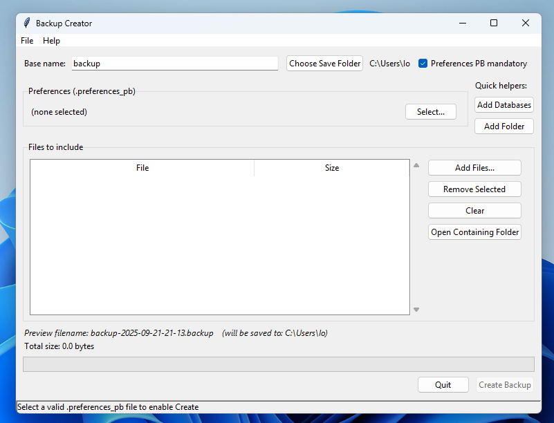
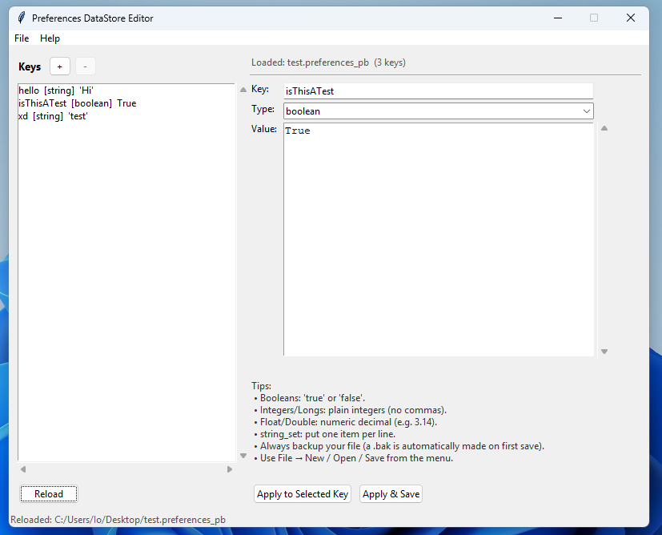
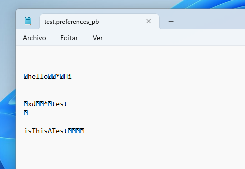

# Proto Editor Suite

A modern, user-friendly toolkit for managing and creating backup and preferences files for various applications. This suite consists of two main tools:

- **Backup Creator** (backupcreator.pyw)
- **Preferences DataStore Editor** (editor.pyw)

---

## 🌟 Features Overview

### 🗜️ Backup Creator

- **Create new backup files** with a simple, intuitive GUI
- **Menu bar** with File → Open Backup (open `.backup`/`.zip` files in a separate window)
- **Clone files** from opened backups (except preferences) into the current backup
- **Drag & drop support** for files and folders (uses `tkinter.dnd` if available)
- **Preferences file optionality**: Checkbox to make `.preferences_pb` file optional
- **Progress bar** showing actual bytes written while creating archives (threaded for responsiveness)
- **Right-click context menu** on file list for quick actions
- **Add Folder**: Recursively add directories
- **Quick helper** to add `.db` files (e.g., `song.db`)
- **Emoji-based file-type icons** in the file list for visual clarity
- **Total size display** and duplicate prevention
- **Extract/open actions** for included files
- **No external dependencies**: 100% Python standard library

### 📝 Preferences DataStore Editor

- **Open, edit, and create new `.preferences_pb` files**
- **Full support for protobuf-encoded key/value pairs**
- **Type-aware editing**: boolean, integer, long, float, double, string, string_set
- **Add, remove, and edit keys** with type selection
- **Apply changes to selected key or all keys**
- **Reload, save, and save as** with automatic backup on first save
- **Tips and guidance** for value formats
- **Modern, clean UI** with OS-native look
- **No external dependencies**

---

## 🎨 Screenshots

### Backup Creator

### Preferences DataStore Editor

### Result (Compiled Proto) (Use this for apps)

---

## 💡 Inspiration: Innertune Corrupt Backup

This project was inspired by the [Innertune](https://github.com/malopieds/Innertune) project, specifically because my backup corrupted, in despair i tried editing it using a text editor which did not work due to the horrible way Proto is made, so i made these scripts to fix that problem:

- A **dedicated backup creator** with drag-and-drop, progress tracking, and file management
- A **full-featured preferences editor** for `.preferences_pb` files, supporting all value types
- The ability to **create new backups and preferences files from scratch**
- Compatibility with a wide range of file types, not just those used by Innertune

---

## 🛠️ How It Works

### Backup Creator (backupcreator.pyw)
- **Select a base name** and save folder for your backup
- **Add files or folders** to include in the backup (supports drag & drop)
- **Optionally select a preferences file** (`.preferences_pb`)
- **Preview the backup filename** and total size before creating
- **Create the backup** with a progress bar showing real-time status
- **Open and extract from existing backups**
- **Clone files** from other backups (except preferences) into your current backup
- **Right-click** on files for quick actions (remove, open folder)

### Preferences DataStore Editor (editor.pyw)
- **Open or create a `.preferences_pb` file**
- **View all keys** and their types/values
- **Add new keys** with type selection (boolean, integer, long, float, double, string, string_set)
- **Edit values** with type-aware input
- **Remove keys** as needed
- **Apply changes** to selected key or all keys
- **Save or save as** (with automatic `.bak` backup on first save)
- **Reload** to revert to last saved state
- **Tips** provided for correct value formatting

---

## 📦 File Compatibility

- **Backup Creator** works with most file types, including `.preferences_pb`, `.db`, `.txt`, `.json`, `.png`, `.jpg`, `.mp3`, `.wav`, `.zip`, and more.
- **Preferences Editor** is designed for protobuf-encoded `.preferences_pb` files, but you can create new ones from scratch.

---

## 📝 Script Details & Explanations

### backupcreator.pyw
- Uses **Tkinter** for the GUI, with `ttk` for modern widgets
- **Menu bar** for file operations and help/about
- **Treeview** for file list with emoji icons and file sizes
- **Threaded backup creation** to keep the UI responsive
- **Drag & drop** support (best effort, falls back if not available)
- **Context menu** for file actions
- **Progress bar** and status updates
- **No external dependencies**

### editor.pyw
- Uses **Tkinter** and `ttk` for a clean, native UI
- **Protobuf parsing/encoding** implemented from scratch (no external libraries)
- **Type-aware editing** for all supported value types
- **Listbox** for keys, with add/remove buttons
- **Details pane** for editing key, type, and value
- **Menu bar** for file operations and help
- **Automatic backup** on first save
- **Tips** for correct value entry
- **No external dependencies**

---

## 🚀 Getting Started

1. **Run backupcreator.pyw** to create or manage backup files
2. **Run editor.pyw** to edit or create `.preferences_pb` files
3. **No installation required** – just double-click or run with Python 3

---

## 🙏 Credits & Thanks

- Inspired by [Innertune](https://github.com/malopieds/Innertune) and its approach to backup file handling
- All code and UI built from scratch using Python's standard library

---

## 📧 Feedback & Contributions

Feel free to open issues or suggest improvements!

---

> **Note:** This project is not affiliated with Innertune or its authors. It is an independent tool inspired by their work.